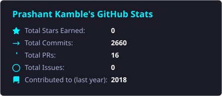
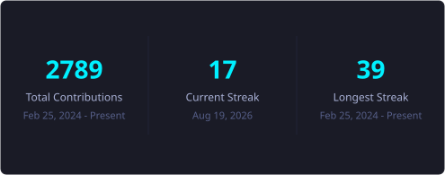

  

  

<h1 align="center">Hello &nbsp; , I'm Prashant Kamble</h1>

  

  Aerospace Engineer | Data Scientist | R&D Simulation Enthusiast

  <h2>🌐 Connect with Me</h2>
  
Discover my work and connect on these platforms!

  <table style="border-collapse: collapse; border: none;">
    <tr style="border: none;">
      <td align="center" style="border: none; padding: 10px;">
        
      </td>
      <td align="center" style="border: none; padding: 10px;">
        
      </td>
      <td align="center" style="border: none; padding: 10px;">
        
      </td>
      <td align="center" style="border: none; padding: 10px;">
        
      </td>
      <td align="center" style="border: none; padding: 10px;">
        
      </td>
    </tr>
  </table>

 

  

---

<h2 align="center">🚀 About Me</h2>

I am an Aerospace Engineering graduate and R&D researcher specializing in **Aircraft Design**, **Computational Fluid Dynamics (CFD)**, and **Finite Element Analysis (FEA)**. I have a deep passion for combining aerospace engineering domain expertise with modern data science practices (Python, SQL, Machine Learning) to build safer, more efficient flight structures and propulsion systems. I bridge the gap between physical engineering simulations and predictive data science pipelines to deliver optimal performance.

---

<h2 align="center">🎓 Certifications &amp; Professional Badges</h2>

  <table style="width:100%; table-layout:fixed; border-collapse: collapse; border: none;">
    <colgroup>
      <col style="width:25%">
      <col style="width:25%">
      <col style="width:25%">
      <col style="width:25%">
    </colgroup>
    <tr style="border: none;">
      <!-- Icon Row -->
      <td align="center" style="border: none; padding: 10px;">
        
      </td>
      <td align="center" style="border: none; padding: 10px;">
        
      </td>
      <td align="center" style="border: none; padding: 10px;">
        
      </td>
      <td align="center" style="border: none; padding: 10px;">
        
      </td>
    </tr>
    <tr style="border: none;">
      <!-- Text Row -->
      <td align="center" valign="top" style="border: none; padding: 10px; color: var(--text-secondary); font-size: 0.9rem;">
        🗓️ 2024  
        <em>Validates advanced orbital mechanics, satellite coverage &amp; link budgets.</em>
      </td>
      <td align="center" valign="top" style="border: none; padding: 10px; color: var(--text-secondary); font-size: 0.9rem;">
        🗓️ 2024  
        <em>Validates advanced solid modeling, parts, and assembly design configurations.</em>
      </td>
      <td align="center" valign="top" style="border: none; padding: 10px; color: var(--text-secondary); font-size: 0.9rem;">
        🗓️ 2024  
        <em>Validates structural design, assembly engineering, and 3D modeling on 3DEXPERIENCE.</em>
      </td>
      <td align="center" valign="top" style="border: none; padding: 10px; color: var(--text-secondary); font-size: 0.9rem;">
        🗓️ 2022  
        <em>IBM certification covering Python, SQL, Data Visualization, and Machine Learning.</em>
      </td>
    </tr>
  </table>

---

<h2 align="center">🛠️ Technical Toolkit</h2>

  <table style="border-collapse: collapse; border: 1px solid rgba(255,255,255,0.1); width: 80%;">
    <tr>
      <td align="center" style="padding: 10px;"><b>Programming Languages</b></td>
      <td align="center" style="padding: 10px;"><b>Data Science &amp; Machine Learning</b></td>
      <td align="center" style="padding: 10px;"><b>Engineering Simulation &amp; DevOps</b></td>
    </tr>
    <tr>
      <td align="center" style="padding: 15px;">
        
      </td>
      <td align="center" style="padding: 15px;">
        
      </td>
      <td align="center" style="padding: 15px;">
        
      </td>
    </tr>
  </table>

 

  <table style="border-collapse: collapse; border: 1px solid rgba(255,255,255,0.1); width: 80%;">
    <tr>
      <td align="center" style="padding: 10px;"><b>CAD &amp; Design</b></td>
      <td align="center" style="padding: 10px;"><b>CFD &amp; FEA Simulation</b></td>
      <td align="center" style="padding: 10px;"><b>Orbital Analysis</b></td>
    </tr>
    <tr>
      <td align="center" style="padding: 15px; vertical-align: middle;">
         
         
        
      </td>
      <td align="center" style="padding: 15px; vertical-align: middle;">
         
        
      </td>
      <td align="center" style="padding: 15px; vertical-align: middle;">
        
      </td>
    </tr>
  </table>

---

<h2 align="center">🚀 Featured R&amp;D Projects &amp; Experience</h2>

#### 🏢 **Lead Software Engineer & Founder** @ Aeromyne *(Jun 2024 – Present)*
* **Architected a zero-trust, distributed cloud storage platform** utilizing client-side AES-256 encryption and a custom chunked file-sharding architecture to guarantee absolute data privacy and integrity for engineering clients.
* **Designed and built a multi-window Web OS interface** using React and Vite, optimizing rendering performance and client-side state synchronization to handle complex hierarchical directory systems seamlessly.
* **Engineered a high-throughput Node.js streaming proxy** featuring real-time, on-the-fly container remuxing (dual-audio MKV) and dynamic subtitle extraction, achieving sub-second start latency and smooth seeking controls.
* **Delivered custom scientific computing tools and automated data pipelines** for engineering clients, accelerating numerical analysis and simulation extraction workflows by an estimated **20%**.

#### 🏢 **Aircraft Design Intern** @ Jet Aerospace *(Sep 2025 – Mar 2026)*
* **Optimized UAV wing and fuselage structures** in CATIA and SolidWorks, improving aerodynamic lift-to-drag (L/D) ratios by **8%** across 5 distinct flight configurations.
* **Conducted 15+ high-fidelity CFD and FEA simulation cycles** (ANSYS Fluent / ANSYS Mechanical), identifying and mitigating structural stress concentrations by **12%** under critical aerodynamic load limits.
* **Achieved a 5% reduction in overall structural weight** by integrating electronic components directly into load-bearing composite panels, maintaining structural integrity under peak load cases.
* 📄 **[View Internship Certificate](certificates/INTERNSHIP.pdf)**

#### 🚀 **Saturn V F-1 Nozzle Bolted Joint FEA**
* **Non-Linear Structural FEA:** Conducted high-fidelity 3D structural analysis on the bolted flange joint connecting the F-1 engine's mid and lower nozzle sections in ANSYS Mechanical.
* **Ascent Load Cases:** Modeled stress distributions, structural deformation, and joint separation risks under critical ascent pressure loads (up to 4.72 MPa) and high thermal gradients (up to 500°C).
* **Pretension & Safety Margins:** Evaluated bolt pretension parameters and stress relaxation of Inconel 718 bolts, verifying safety margins against hot-gas leakage.
* **Open Source Repository:** [Link to FEA Project](https://github.com/Prashantsk45/Saturn-V-F1-Nozzle-Joint-FEA)

#### 📊 **SpaceX Falcon 9 Landing Success Prediction**
* **Machine Learning Pipelines:** Developed and optimized Classification Models (SVM, Decision Trees, KNN, Logistic Regression) using **scikit-learn** and **TensorFlow** to predict booster reuse landing success with **89% accuracy**.
* **Data Engineering & Wrangling:** Extracted launch data via SpaceX REST API and web-scraped Wikipedia, preprocessing 18 core features (payload mass, launch site, orbit trajectory) using SQL and Pandas.
* **Interactive Geo-Visualization:** Built a dashboard in **Plotly Dash** and mapped launch sites with success heatmaps in **Folium** to discover key geospatial features affecting booster landings.
* **Live Case Study:** [Link to Landing Success Case Study](https://prashantsk45.github.io/projects/falcon9_landing_analysis.html)

#### 🌪️ **CFD Airfoil Validation (C++)**
* **Aerodynamic Drag Validation:** Modeled and validated NACA 0012 airfoil drag ($C_D$) and lift ($C_L$) coefficients in ANSYS Fluent to within **3–5%** of experimental NASA wind tunnel data.
* **C++ UDF Customization:** Programmed custom **C++ User-Defined Functions (UDFs)** to configure boundary-layer turbulence parameters and wall-y+ values under high Reynolds number flows.
* **Mesh Independence Analysis:** Completed grid convergence index (GCI) studies across structural C-grid meshes, reducing computation time by **20%** while preserving accuracy.

---

<h2 align="center">📚 R&amp;D Publications</h2>

  <table style="width:100%; border-collapse: collapse; border: none;">
    <tr style="border: none;">
      <td width="50%" style="border: none; padding: 15px; vertical-align: top;">
        <h3>🔩 CNT-Rubber Composites for Landing Gear</h3>
        <i>6th International Conference (RAFAS) | 2025</i>  
        Synthesized carbon nanotube (CNT) rubber composite shock disks, achieving a <b>25–30% tensile strength gain</b> and improving landing gear material durability by <b>30%</b>.
          
        📄 <a href="https://prashantsk45.github.io/papers/CNT_Natural_Rubber_Composites_Landing_Gear.pdf" target="_blank"><b>Read Publication PDF</b></a>
      </td>
      <td width="50%" style="border: none; padding: 15px; vertical-align: top;">
        <h3>🚀 Additives on Hybrid Rocket Propellant</h3>
        <i>2nd International Conference (ICAAE) | 2025</i>  
        Formulated propellant containing NaBH4 and KBH4 metallic additives, increasing specific impulse by <b>10%</b> and mapping performance curves in NASA CEA and MATLAB.
          
        📄 <a href="https://prashantsk45.github.io/papers/Combustion_Thrust_Hybrid_Rocket_Motors.pdf" target="_blank"><b>Read Publication PDF</b></a>
      </td>
    </tr>
  </table>

---

<h2 align="center">📊 GitHub Activity &amp; Metrics</h2>

  
  

 

  

 

  

